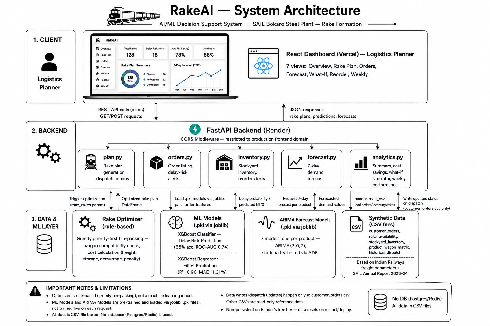

# RakeAI
**AI/ML Decision Support System for Rake Formation — SAIL Bokaro Steel Plant**

---

## Live Demo

- **Dashboard:** https://rake-ai-f6tu-sigma.vercel.app
- **API Docs:** https://rakeai-dwal.onrender.com/docs

> Note: Backend runs on Render's free tier, which spins down after 15 minutes of inactivity. First request after idle may take 30–50 seconds to respond.

---

## Problem

SAIL Bokaro manually plans railway rake dispatch every morning using SAP and Excel. This process:
- Takes 3–4 hours daily per logistics planner
- Results in ~70% average rake fill (30% capacity wasted)
- Causes missed deadlines due to poor order prioritization
- Has no predictive visibility into delays or stockouts
- Costs crores in avoidable demurrage and penalty charges

---

## Solution

RakeAI automates the entire planning process using AI/ML:
- **Optimizer** clubs multiple orders into single rakes to maximize fill rate
- **ML models** predict delay risk per order before dispatch
- **ARIMA forecasting** predicts next 7 days demand per product
- **What-If simulator** models financial impact of delays in real time
- **Smart alerts** flag critical orders, low stock, and fill anomalies proactively

Result: A logistics planner opens the dashboard at 8am and the optimal rake plan is already ready.

---
## System Architecture


---

## Results

- Rake fill rate: **94.3%** vs industry average of 70%
- Estimated saving: **₹1.93 Crore/day** → ₹704 Crore/year
- Planning time: **30 seconds** vs 3–4 hours manually

---

## ML Models

| Model | Algorithm | Result |
|---|---|---|
| Delay Prediction | XGBoost Classifier | 65% accuracy, ROC-AUC 0.74 |
| Fill % Prediction | XGBoost Regressor | R² = 0.96, MAE = 1.31% |
| Demand Forecast | ARIMA (2,0,2) | 7 products × 7 days ahead |

---

## Tech Stack

- **Backend:** Python, FastAPI, Scikit-learn, XGBoost, Statsmodels
- **Frontend:** React, Recharts
- **Data:** Synthetic data based on Indian Railways freight parameters and SAIL Annual Report 2023–24
- **Deployment:** Render (backend), Vercel (frontend)

---

## Architecture

```
backend/
  main.py                → FastAPI app entrypoint, CORS, router registration
  routes/
    plan.py               → /rake-plan, /dispatch-rake, /dispatch-order
    orders.py              → /orders, /alerts
    inventory.py            → /inventory, /rakes, /reorder-alerts
    forecast.py              → /forecast
    analytics.py              → /summary, /cost-savings, /whatif, /weekly-performance
optimization/
  rake_optimizer.py        → Core rake-clubbing optimization logic
ml/
  saved_models/              → Trained XGBoost + ARIMA model artifacts
  *.ipynb                      → Training notebooks
data/
  synthetic_data/                → Generated CSVs (orders, inventory, rakes, dispatch history)
  generate_data.py                 → Synthetic data generator
frontend/
  src/App.js                        → Full dashboard UI (7 views, single-file React app)
```

---

## Local Setup

```bash
# 1. Install dependencies
pip install -r requirements.txt

# 2. Generate data
python data/generate_data.py

# 3. Train models (run all cells in each notebook)
# ml/delay_prediction.ipynb
# ml/fill_prediction.ipynb
# ml/demand_forecast.ipynb

# 4. Start backend
uvicorn backend.main:app --reload

# 5. Start frontend
cd frontend && npm install && npm start
```

Dashboard → `http://localhost:3000`
API Docs  → `http://127.0.0.1:8000/docs`

For local frontend/backend to talk to each other, set `frontend/.env`:
```
REACT_APP_API_URL=http://127.0.0.1:8000
```

---

## Known Limitations

- **Dispatch state is not persistent in production.** Render's free-tier filesystem is ephemeral — dispatches update `customer_orders.csv` live, but a server restart (idle timeout or redeploy) resets it to the last committed version. A production deployment would use a real database instead of CSV files.
- **Weekly performance chart uses seeded random data**, not real historical dispatch records, for demonstration purposes.
- **No automated tests** currently cover the optimizer or ML pipeline.
- Real SAIL data is proprietary — synthetic data mirrors real operational parameters. In production, only the data ingestion layer needs replacing with SAP API connectors; all ML models and optimization logic remain unchanged.